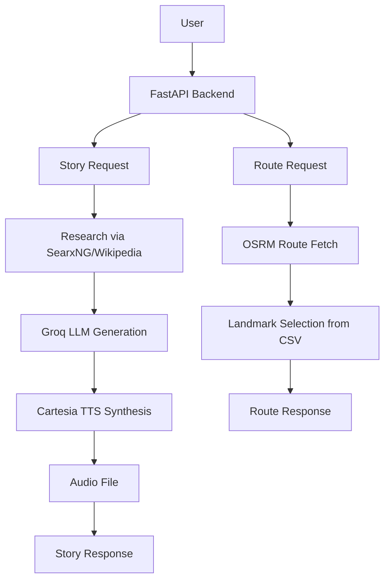

# tourism_superai

Agentic AI Roadtrip is a minimal proof-of-concept backend for travel route planning and location storytelling.

## Overview

- `src/tourism_superai/api.py` is the FastAPI backend providing route building and story generation endpoints.
- `src/tourism_superai/trip_design.py` contains a trip planning agent powered by Groq and SearxNG research.
- `src/tourism_superai/storyteller.py` generates narrated story segments and optional TTS audio via Cartesia.
- `src/tourism_superai/data/attraction_clean.csv` contains the attraction dataset used for route-based landmark selection.
- `frontend/demo.html` is a simple demo front-end for the API.

## Workflow



## Requirements

Install dependencies from `requirements.txt`:

```bash
pip install -r requirements.txt
```

## Environment

Copy `.env.example` to `.env` and fill in required keys:

```bash
cp .env.example .env
```

Required values:

- `GROQ_API_KEY`
- `CARTESIA_API_KEY`
- `CARTESIA_VOICE_ID`
- `SEARXNG_BASE_URL`
- `WIKIMEDIA_USER_AGENT`

## Run the backend

Install dependencies:

```bash
pip install -r requirements.txt
```

Run directly:

```bash
python run.py --reload
```

Or install the project locally and use the script entry point:

```bash
pip install -e .
tourism-superai
```

Then visit:

- `http://127.0.0.1:8000/api/health`
- `http://127.0.0.1:8000/api/provinces`
- `http://127.0.0.1:8000/`

## Notes

- The backend uses OSRM for route geometry when available and falls back to a linear route generator.
- Story generation is only available when `GROQ_API_KEY` and `CARTESIA_API_KEY` are configured.
