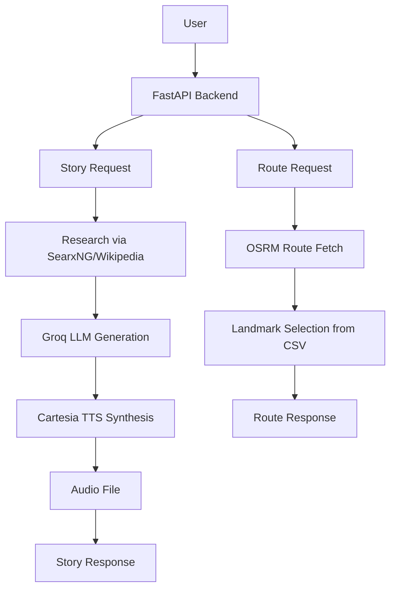

# tourism_superai

Agentic AI Roadtrip is a minimal proof-of-concept backend for travel route planning and location storytelling.

## Overview

- `src/tourism_superai/api.py` is the FastAPI backend providing route building and story generation endpoints.
- `src/tourism_superai/trip_design.py` contains a trip planning agent powered by Groq and SearxNG research.
- `src/tourism_superai/storyteller.py` generates narrated story segments and optional TTS audio via Cartesia.
- `src/tourism_superai/data/attraction_clean.csv` contains the attraction dataset used for route-based landmark selection.
- `frontend/demo.html` is a simple demo front-end for the API.

## Workflow



## Requirements

Install dependencies from `requirements.txt`:

```bash
pip install -r requirements.txt
```

## Environment

Copy `.env.example` to `.env` and fill in required keys:

```bash
cp .env.example .env
```

Required values:

- `GROQ_API_KEY`
- `CARTESIA_API_KEY`
- `CARTESIA_VOICE_ID`
- `SEARXNG_BASE_URL`
- `WIKIMEDIA_USER_AGENT`

## Run the backend

Install dependencies:

```bash
pip install -r requirements.txt
```

Run directly:

```bash
python run.py --reload
```

Or install the project locally and use the script entry point:

```bash
pip install -e .
tourism-superai
```

Then visit:

- `http://127.0.0.1:8000/api/health`
- `http://127.0.0.1:8000/api/provinces`
- `http://127.0.0.1:8000/`

## API Documentation

Swagger UI is available after starting the backend:

- Swagger UI: `http://127.0.0.1:8000/docs`
- ReDoc: `http://127.0.0.1:8000/redoc`
- OpenAPI JSON: `http://127.0.0.1:8000/openapi.json`

### `GET /api/health`

Checks whether the API is running and reports dataset/storyteller readiness.

Example response:

```json
{
  "status": "ok",
  "service": "agentic_api",
  "attraction_count": "1200",
  "storyteller_ready": "True",
  "groq_model": "openai/gpt-oss-120b"
}
```

### `GET /api/provinces`

Returns Thai provinces that have attraction coordinates available for route planning.

Example response:

```json
{
  "items": ["กรุงเทพมหานคร", "เชียงใหม่"],
  "count": 2
}
```

### `POST /api/route`

Builds a scenic route between two Thai provinces and returns route points, distance, and nearby landmarks.

Example request:

```json
{
  "start_province": "กรุงเทพมหานคร",
  "end_province": "เชียงใหม่",
  "max_landmarks": 12,
  "max_distance_to_route_km": 15.0
}
```

Example response shape:

```json
{
  "start_province": "กรุงเทพมหานคร",
  "end_province": "เชียงใหม่",
  "route_points": [[13.75, 100.49]],
  "distance_km": 685.42,
  "landmarks": [
    {
      "name": "Example landmark",
      "province": "Example province",
      "lat": 13.75,
      "lon": 100.49,
      "detail": "Short description",
      "category": "Attraction",
      "distance_to_route_km": 2.5,
      "route_segment_index": 4
    }
  ],
  "routing_mode": "osrm"
}
```

### `POST /api/story`

Generates a location-based travel story. This endpoint requires `GROQ_API_KEY`; audio generation also requires `CARTESIA_API_KEY`.

Example request:

```json
{
  "keyword": "วัดพระแก้ว",
  "latitude": 13.7515,
  "longitude": 100.4924,
  "user_context": "family roadtrip from Bangkok",
  "language": "th",
  "generate_audio": false
}
```

Example response shape:

```json
{
  "triggered": true,
  "story": {
    "trigger_keyword": "วัดพระแก้ว",
    "place_name": "วัดพระแก้ว",
    "headline": "Story headline",
    "narration_script": "Narration text",
    "audio_url": null
  },
  "media": {
    "image_url": null,
    "summary": null,
    "source_url": null
  }
}
```

### `GET /api/audio/{filename}`

Streams a generated story audio file. The filename is returned as `audio_url` from `/api/story` when audio generation succeeds.

## Notes

- The backend uses OSRM for route geometry when available and falls back to a linear route generator.
- Story generation is only available when `GROQ_API_KEY` and `CARTESIA_API_KEY` are configured.
